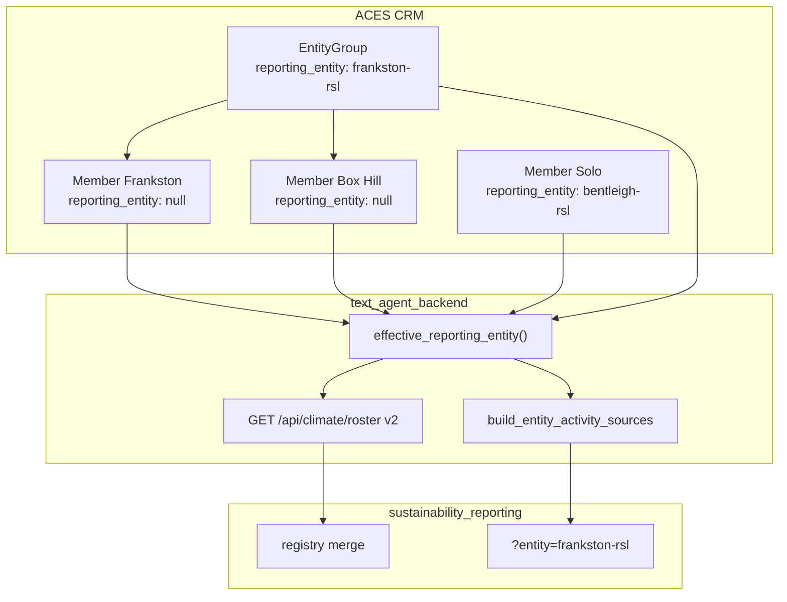

# Entity groups ↔ climate disclosure — design note

**Status:** Proposed (not implemented)  
**Date:** 10 June 2026  
**Repos:** `text_agent_backend`, `text_agent_interface`, `sustainability_reporting`  
**Related:** [`morgan-integration.md`](./morgan-integration.md), [`marcus-integration.md`](../../sustainability_reporting/docs/marcus-integration.md), [`frankston-rsl-integration-audit.md`](./frankston-rsl-integration-audit.md)

---

## Problem

ACES CRM now has **commercial entity groups** (`entity_groups`, `/crm-groups`) for multisite operators. Prograde / B4 disclosure uses **`reporting_entity`** (A1 kebab-case slug) as the cross-system primary key.

Today these are **separate**:

| Concept | Storage | Used by |
|---------|---------|---------|
| Entity group | `clients.entity_group_id` → `entity_groups` | CRM hub, offers rollup, site assignment |
| Reporting entity | `clients.reporting_entity` only | Prograde URL, activity-sources, roster, registry merge |

**Group membership alone does not roll up climate data.** Only clients with `reporting_entity` set are included in `build_entity_activity_sources`. Example: Frankston group includes Box Hill (client 21) with `reporting_entity=null` — Box Hill’s LOA never reaches Prograde.

---

## Design goal

Support **flexible disclosure scope**:

1. **Consolidated group** — one Prograde `entity_id`; all group members’ LOAs and staged activity merged.
2. **Individual site** — one member with its own `reporting_entity`; separate Prograde workspace (today’s behaviour).
3. **Mixed** — some members inherit group slug; others override with site-level slug.

Prograde URL and registry merge key stay **`reporting_entity`** (disclosure slug). Do not use `entity_group.slug` as a substitute unless they are explicitly set to the same value.

---

## Resolution rule (proposed)

```text
effective_reporting_entity(client) =
  client.reporting_entity                    # site-level override (non-null wins)
  ?? client.entity_group.reporting_entity    # group default (new column)
  ?? null
```

| Mode | Configuration | In rollup for slug X? |
|------|---------------|------------------------|
| Consolidated | Group has `reporting_entity=X`; members null or also X | All inheriting members |
| Site-only | Member has `reporting_entity=Y`; no group or group without slug | Member only (slug Y) |
| Mixed | Group X; member A null (inherits X); member B has Y | A → X rollup; B → separate entity Y |

**Rule:** A non-null **member** `reporting_entity` that **differs** from the group slug excludes that member from the group rollup (site-level disclosure).

---

## Data model changes (ACES backend)

### New column

```sql
ALTER TABLE entity_groups ADD COLUMN reporting_entity VARCHAR(128) NULL;
CREATE INDEX ix_entity_groups_reporting_entity ON entity_groups (reporting_entity);
```

- Same slug validation as `clients.reporting_entity` (kebab-case).
- **`entity_group.slug`** remains the CRM route key (`/crm-groups/frankston-rsl`).
- **`entity_group.reporting_entity`** is the disclosure slug (may equal slug but need not).

### Expand activity-sources client query

Current (`services/climate_entity_sources.py`):

```python
clients = db.query(Client).filter(Client.reporting_entity == slug).all()
```

Proposed: include clients where:

- `Client.reporting_entity == slug`, **or**
- `Client.reporting_entity IS NULL` and joined `EntityGroup.reporting_entity == slug`, **or**
- `Client.reporting_entity == slug` via explicit member match (site override same slug)

Exclude members whose `reporting_entity` is a **different** non-null slug.

### Activity-sources payload additions

```json
{
  "entity_id": "frankston-rsl",
  "entity_group_slug": "frankston-rsl",
  "members": [
    { "aces_client_id": 1, "business_name": "Frankston RSL Sub Branch Inc", "loa_record_id": "recjQ6GSka3b4kiB1", "disclosure_source": "member" },
    { "aces_client_id": 21, "business_name": "Box Hill RSL Sub Branch Inc", "loa_record_id": "rec…", "disclosure_source": "group_inherit" }
  ],
  "aces_client_ids": [1, 21],
  "loa_record_ids": ["recjQ6GSka3b4kiB1", "rec…"]
}
```

Site bundles should tag `member_aces_client_id` / `member_business_name` when LOA came from a specific member.

---

## Climate roster v2 (proposed)

Replace per-client roster rows with **deduped disclosure entities**:

```json
{
  "reporting_entity": "frankston-rsl",
  "display_name": "Frankston RSL",
  "entity_group_slug": "frankston-rsl",
  "member_count": 2,
  "aces_client_ids": [1, 21],
  "loa_record_ids": ["recjQ6GSka3b4kiB1", "rec…"],
  "activity_record_count": 135,
  "primary_abn": "12 643 054 953",
  "deep_link": "/?entity=frankston-rsl&period=FY26"
}
```

**Why:** Prograde launcher and registry merge should show **one card per disclosure entity**, not one per CRM member with the same slug.

---

## Interface (ACES)

| Surface | Change |
|---------|--------|
| `/crm-groups/[slug]` | Edit group `reporting_entity`; Prograde link; “Sync all sites”; staged total across members |
| `EntityGroupSection` | Show inherit vs override; link to group hub |
| `ClimateTab` | Show `effective_reporting_entity`; read-only when inheriting from group |
| Group summary API | Add `members_in_climate_rollup`, `staged_activity_total`, `reporting_entity.aligned` (existing) |

Optional: `POST /api/entity-groups/{slug}/apply-reporting-entity` — bulk-set member `reporting_entity` to group value (explicit operator action).

---

## Prograde (Marcus)

No change to URL shape (`?entity={reporting_entity}`). After ACES roster v2:

| Item | Action |
|------|--------|
| Launcher | Dedupe by `reporting_entity`; show “ACES dynamic · N sites” |
| Activity-sources panel | Member breakdown table (`aces_client_ids`, per-member LOA) |
| Registry stub | Map `member_count`, `entity_group_slug`, `primary_abn` from roster |
| Export gate (pt91) | Unchanged — consolidated dynamic groups remain preview-only until A1 promotion |

---

## End-to-end flow



---

## Frankston validation checklist

- [ ] `entity_groups.id=1` has `reporting_entity=frankston-rsl`
- [ ] Box Hill in group, member slug null → included in activity-sources
- [ ] Oil/Waste LOA fix (P0) → 6 utility types in merged payload
- [ ] Roster returns **one** `frankston-rsl` entry with `member_count: 2`
- [ ] Prograde panel lists both members under consolidated entity
- [ ] Site with own slug (e.g. `bentleigh-rsl`) appears as separate roster entry

---

## Out of scope (this design)

- Replacing n8n business-info (see `N8N_DEPRECATION_PLAN.md`)
- B4 ingest contract (post-Tuesday)
- Automatic inference of group membership from name similarity (suggestions API already exists for CRM assignment only)
